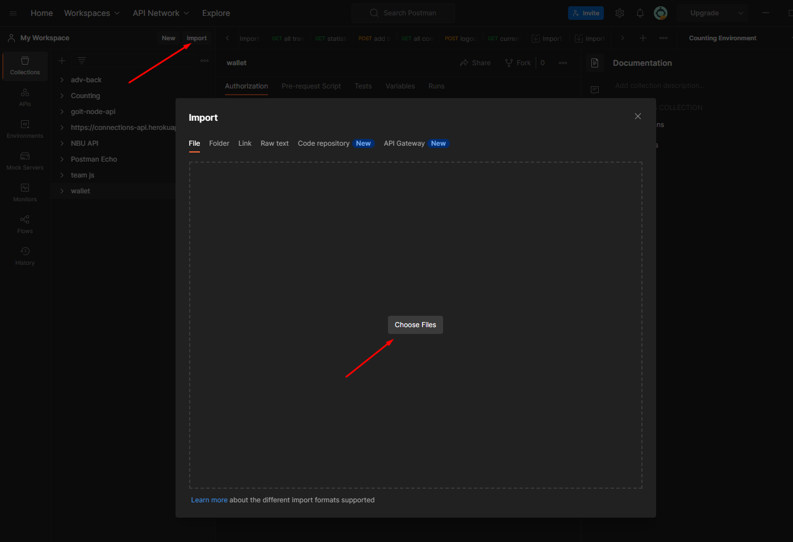
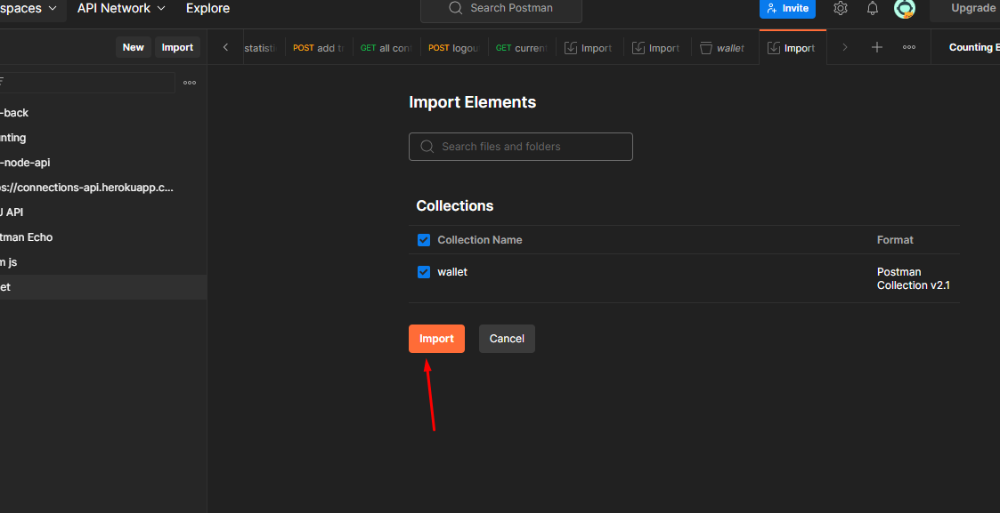
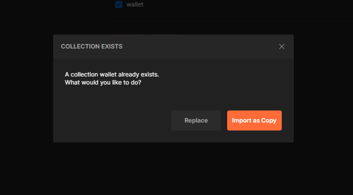
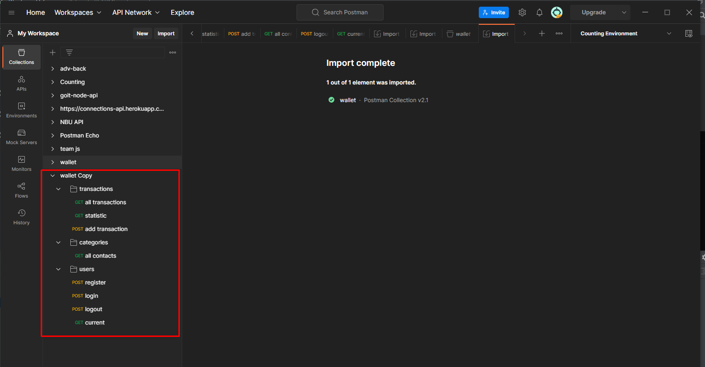
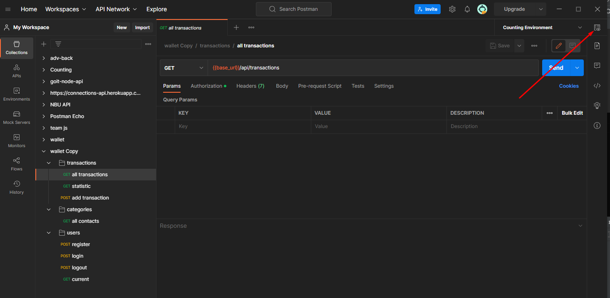
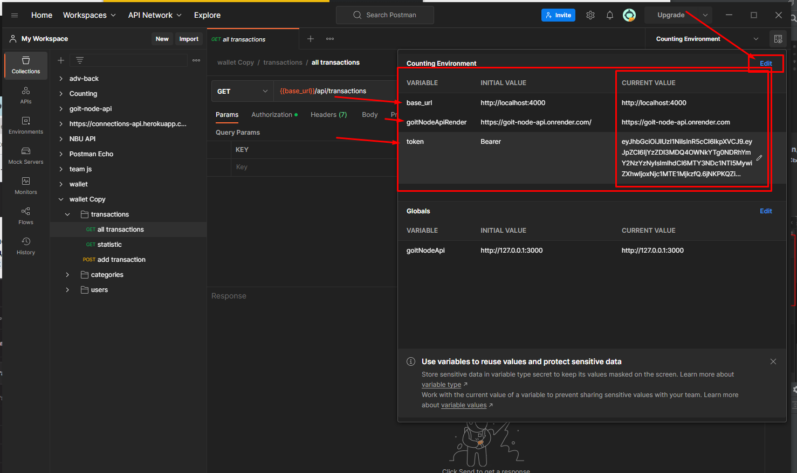
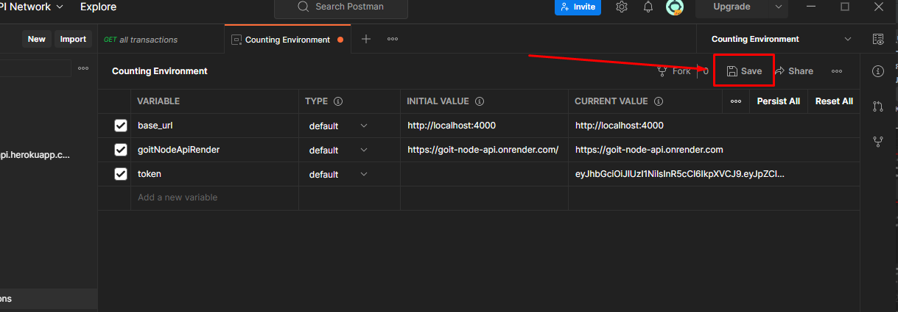

# Postman Export Settings Gide

## Import

- #### За допомогою кнопки import обераємо [цей](./assets/postman/wallet.postman_collection.json) json файл:
  
- #### Тиснемо наступну кнопку import:
  
- #### Обираємо потрібне (опційно)*:
  
- #### Ми імпортували:
  

## Variables

- #### Тиснемо кнопку зі змінними:
  
- #### Заносимо першу і третю змінні (`base_url` & `token`), які використовує postman, (друга змінна - по бажанню). Якщо потрібно перемикатись (це більше для розробника), тоді додаємо другу змінну, щоб було посилання завжди під рукою. Програма використовує саме `current value`. Додавати змінну потрібно через кнопку `edit`:
  
- #### Приклад доданих змінних `base_url` & `token` та змінна із вільною назвою. Сервіс - `https://goit-wallet-back.onrender.com`:
  
